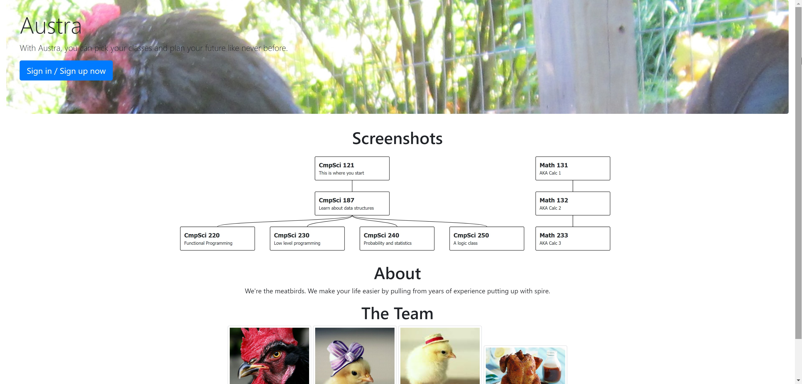
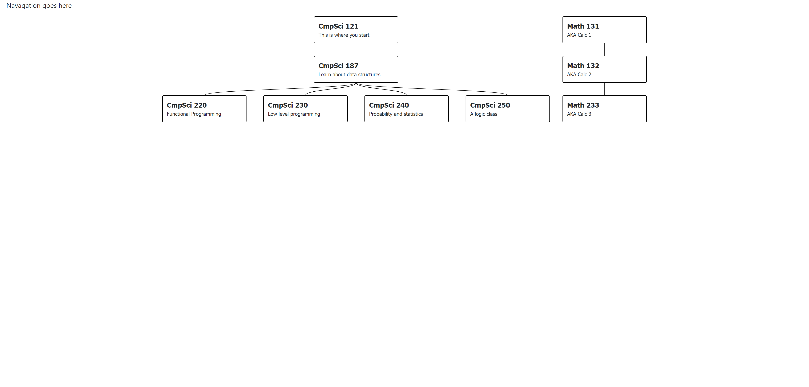
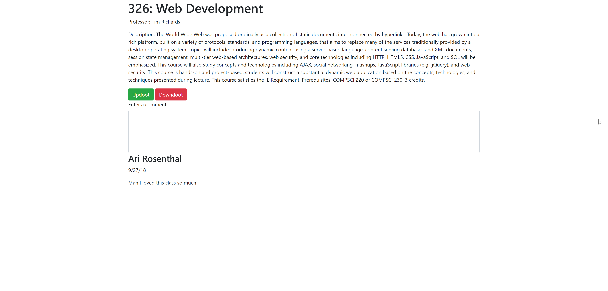
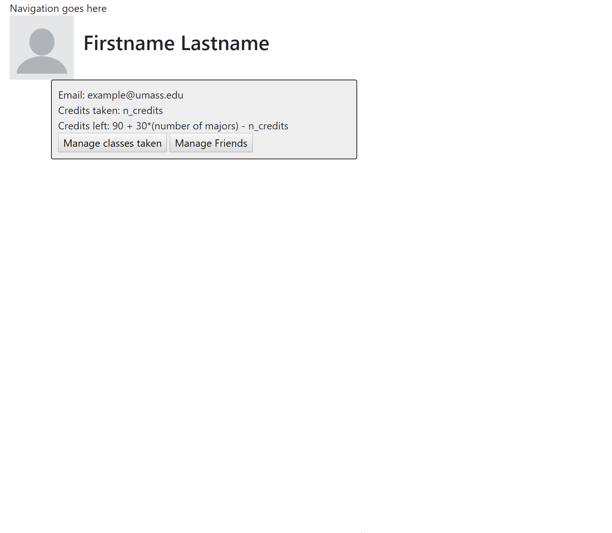

# themeatbirds

# Austra

# Team Overview

* CJ Moynihan, partyrico
* Harrison Orne, vgaparadise
* Arielle Rosenthal, ariellerosen
* Sam Kochanski, bakerdonkey

# Innovative Idea

Austra is a scheduling and planning webapp that provides a user-friendly and feature-rich interface for UMass students to plan their next semester. It aims to replace the unintuitive “shopping cart” feature of SPIRE, which does not give effective feedback on scheduling conflicts, class quality, and class restrictions. Austra provides a graphical calendar view for candidate classes to easily determine conflicts, allows for user rating and reviews of classes/teachers, and by default only allows selection of classes that are applicable to the user. Furthermore, Austra implements a social feature, which allows users to view select other users’ availabilities and class schedules. 

# Important Data

Austra handles class sections as objects with static attributes (instructor, time, locations) and dynamic attributes (students, TAs, discussion sections, comments, rating). A user profile can be linked with other profiles to observe their attendance of class sections, thus a user profile has a friend list. Class sections have ratings that are calculated by a function that inputs class objects’ rating attribute and teacher objects’ rating attribute. Each user profile has personal class data, that determines prerequisites and class eligibility. This data is parsed from an unofficial transcript from SPIRE upon registration.

# User Interface

Austra has a static landing page, which provides links to login and register. Then is has login and registration forms, and the registration form has a required field to upload an unofficial transcript from SPIRE.

The main view has two major components - the class search and the user class session schedule. 

The class search is an accordian view that lists all eligible classes. When a class is selected in the accordian, it provides deeper information on the class session. The elements of the accordion are color-coded based on eligibility. There is a search bar on the top, which filters items from the accordion based on the query entered.

The user class session schedule is a weekly calendar populated with all selected candidate class sessions. When a block on the calendar is clicked a popover appears with all information on the class session. If multiple classes conflict, the calendar provides visual feedback.

Austra also supports a prerequisite tree view, which tracks a user’s progress through a degree that requires specific prerequisite requirements. The tree view is a graphical representation of the progress with each node being a required class. Nodes are colored to differentiate between required, suggested, taken, and unavailable classes. 

There is a page for users to see details about classes and create dynamic data relating to them such as comments and updooting / downdooting. 

There is a page for a user profile. This is where people will set up their friends, change password, and load in information from spire PDFs. 

