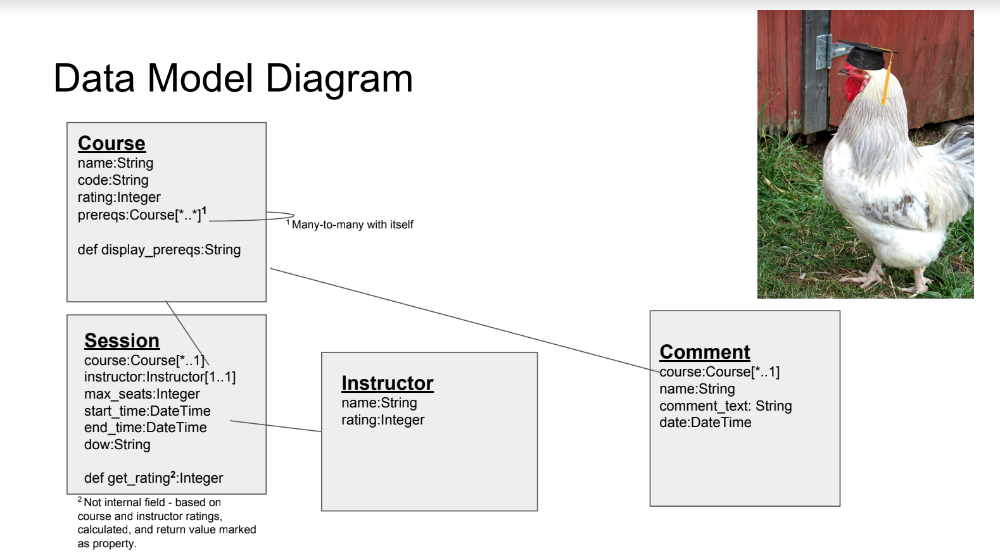

# themeatbirds
## Austra
## Fall 2018

# Overview 
Austra is designed to fulfill a main goal of SPIRE, for students to determine which classes they will be taking and fill out their schedule, in a more intuitive way. Austra’s primary advantage is easily visualization how course candidates conflict and mesh with the graphical interface. Furthermore, it allows for student-oriented feedback for classes and teachers in one place. Austra has social features including profiles and comments. 

# Team Members
CJ Moynihan		    partyrico
Harrison Orne		vgaparadise
Arielle Rosenthal   ariellerosen
Sam Kochanski	    bakerdonkey

# User Interface 
Austra has a static landing page, which provides an entry point and a portal for a user to login and register. There are login and registration forms that handle different levels of authorization.

The main view has two major components - the class search and the user class session schedule. Users can search for classes here, check details of them, as well as add them to the calendar. 

The class search, on the main view, is an accordian that lists all eligible classes. When a class is selected in the accordian, it provides deeper information on the class session. The elements of the accordion are color-coded based on eligibility. There is a search bar on the top, which filters items from the accordion based on the query entered.

The user class session schedule, also on the main view, is a weekly calendar populated with all selected candidate class sessions. If multiple classes conflict, the calendar provides visual feedback.

There are views for class details and instructor details, where users can find additional information about those. 

The user profile view allows users to see details about themselves as well as add classes they’ve taken in the past. 

# Data Model

Austra has four interconnected data structures -- instructors, courses, sessions, and comments. Instructors have a name field and a rating field assigned by superusers. Courses have a name, a code for quick reference (eg. COMPSCI 220), and a rating determined by users. Furthermore, course has a many-to-many relationship with itself to define a list of prerequisites. Sessions are instances of course, and as such they reference a course and an instructor. Also, they have local start and end time, days of the week they are active, and a rating based on that of the instructor and course. Comments were added to our model directly instead of an external framework because we wanted more control of them. It has a one-to-many relationship with courses not sessions because only courses can have comments. 

# URL Routes/Mappings

# Authentication/Authorization
There are two user groups - standard users and admins (superusers). Standard users can modify their schedule by selecting existing course sessions, while admins can create courses, instructors, and sessions in-app. Admins can delete instructors and classes, while users can only remove classes from their schedule. If a user is not authorized to view a page, they are redirected to login form or redirected to the main page.

# Conclusion
We all started this semester without any experience with Django, three of us with a little experience with web programming at all. Therefore, everything we implemented was built on top of a wealth of new technical knowledge, design patterns, and programming methodologies. 

Like with learning anything new, there were growing pains, regrettable pitfalls, and overwhelming moments that lead to some stressful interactions between us. Specifically, our idea was a little nebulous in the beginning, so our design direction was muddled. However, by improving our communication and through actually sitting down with the explicit purpose of talking about it, we solidified our design direction and became much more productive.

If we were to do it all over again, we would focus more on the front-end design. Once its function took form, the program became too delicate to mess with without a lot of extra work. If we had a more complete design idea in the beginning, we could have accounted for this. However, we are generally satisfied with Austra and proud of our accomplishments as individuals and as a team.

